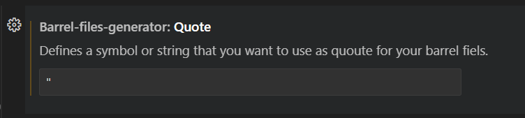

# <strong>Barrel Files Generator</strong>
  

## Extension to create barrel files

**Languages supported** 

    * Dart

  

## Config

### In your vs code settings you can define a symbol as quoute for barrel files ###

## Maintainers

- [Jhon Romero](https://github.com/jhon2520)

